# FourierNet: Compact mask representation for instance segmentation using differentiable shape decoders

This git repo contains the official code for **[FourierNet](https://arxiv.org/abs/2002.02709)**. 


| | |
|:-------------------------:|:-------------------------:|
|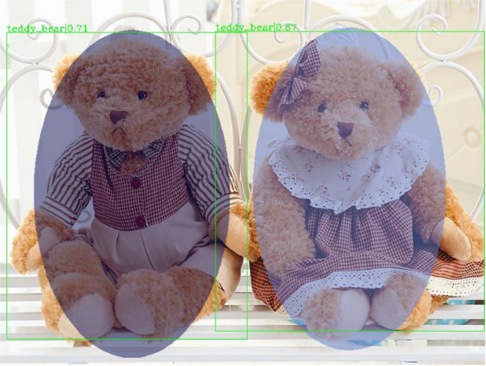  2 fourier coefficients |  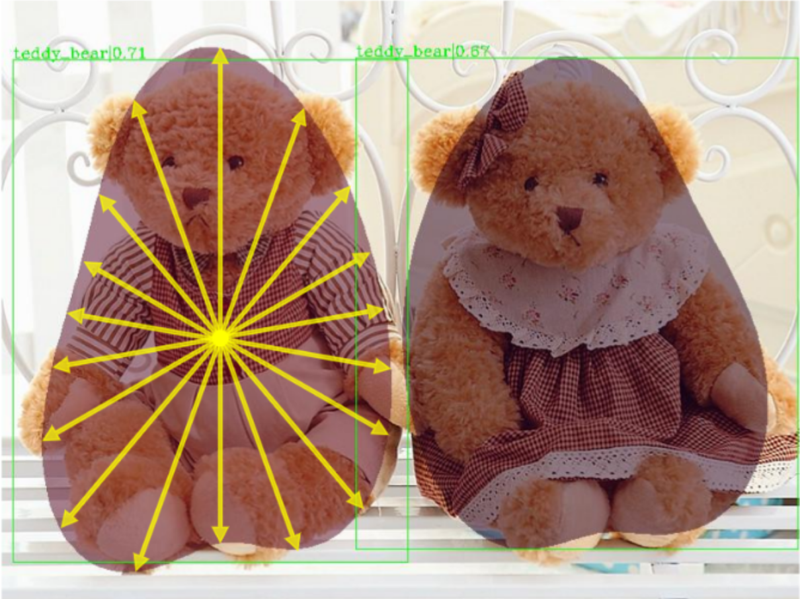 5 fourier coefficients|
|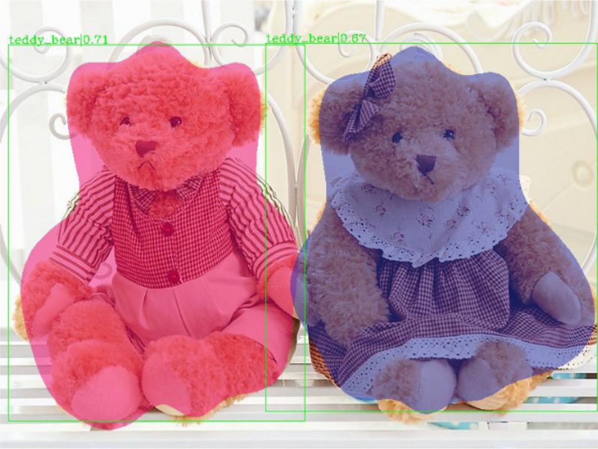  10 fourier coefficients|  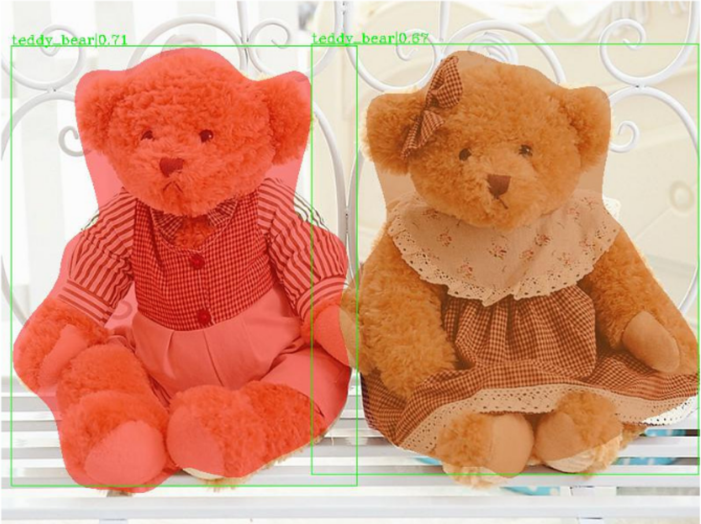 20 fourier coefficients|

 FourierNet  is a  single  shot,  anchor-free,  fully convolutional instance segmentation method, 
 which predicts a shape vector that is converted into contour points using a numerical transformation.
 Compared to previous methods, we introduce a new training technique,  where we utilize a differentiable shape decoder, 
 which achieves automatic weight balancing  of  the  shape  vector’s  coefficients.
 Fourier  series was utilized as a shape encoder because of its coefficient interpretability and fast implementation. 
 By using its lower frequencies we were able to retrieve smooth and compact masks.

## Performance
| | | | |
|:-------------------------:|:-------------------------:|:-------------------------:|:-------------------------:|
|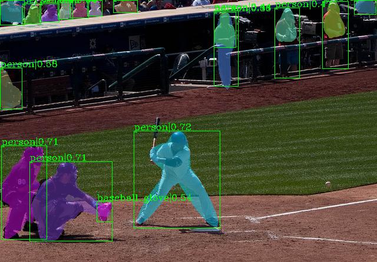 |  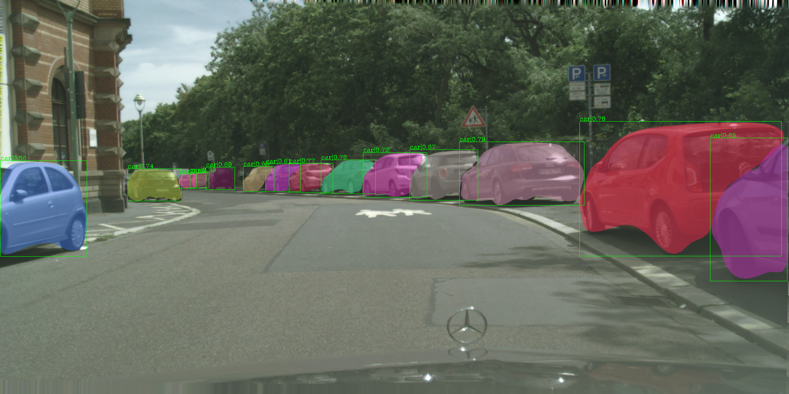|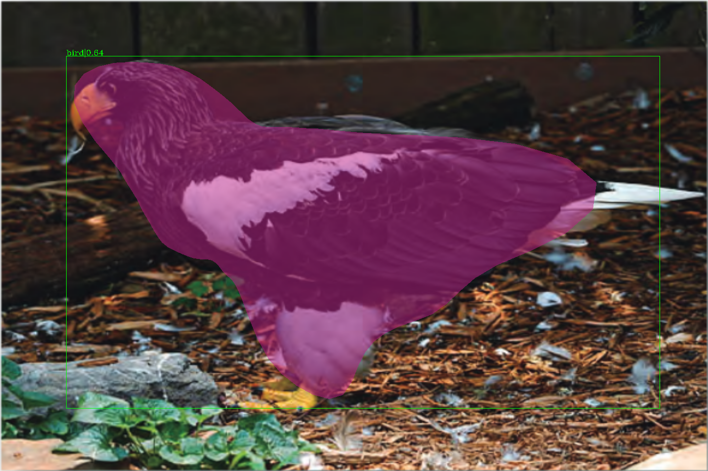|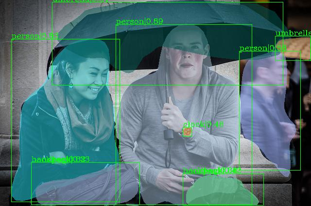|
|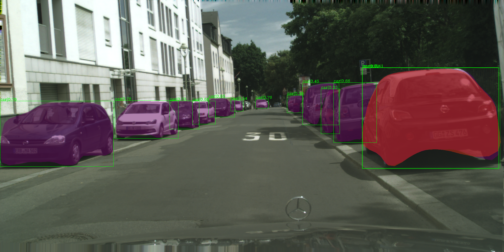 |  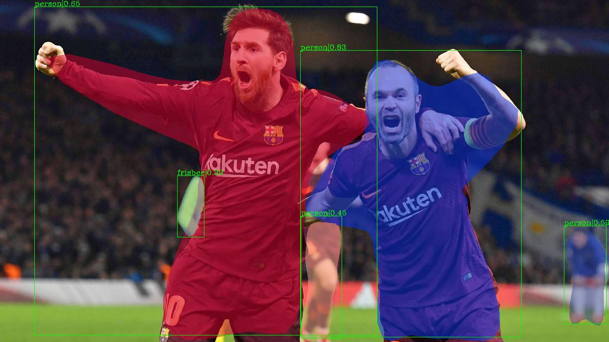|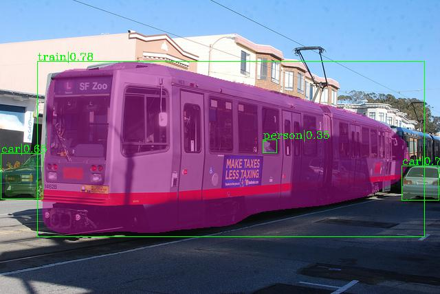|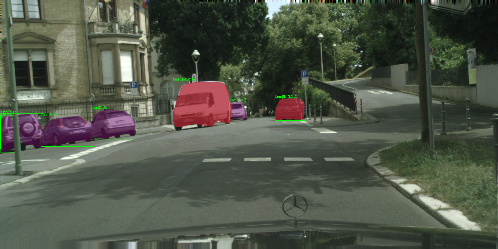|
|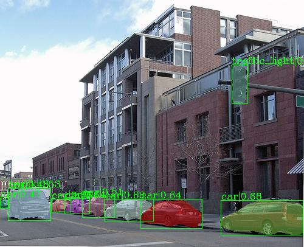 |  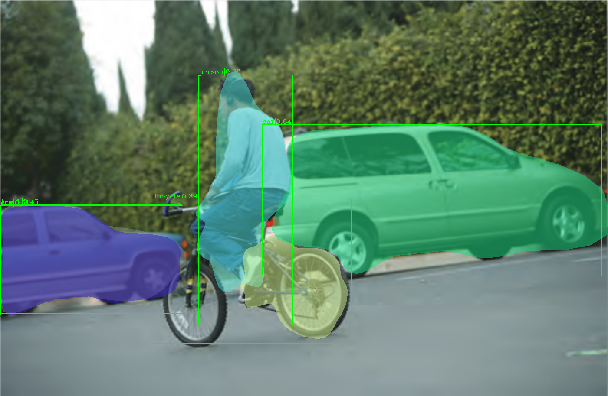|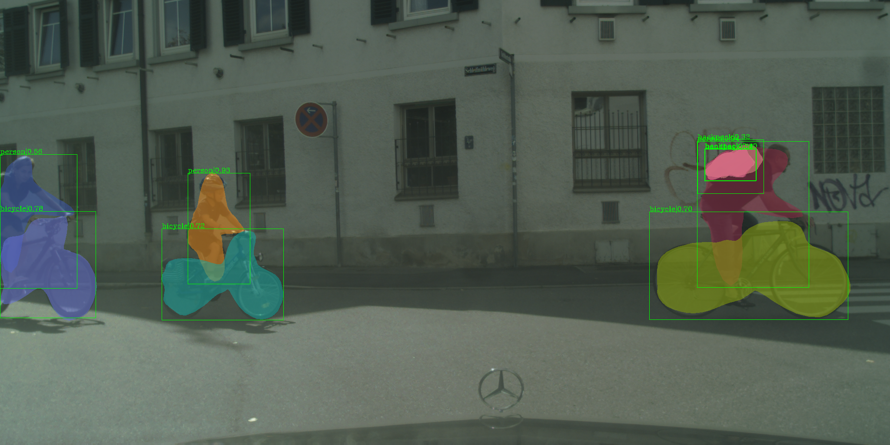|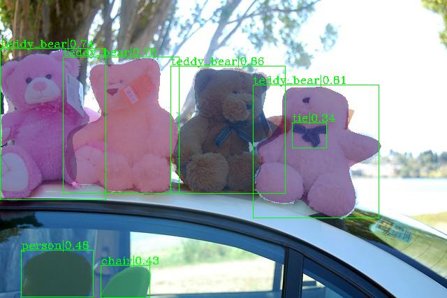|


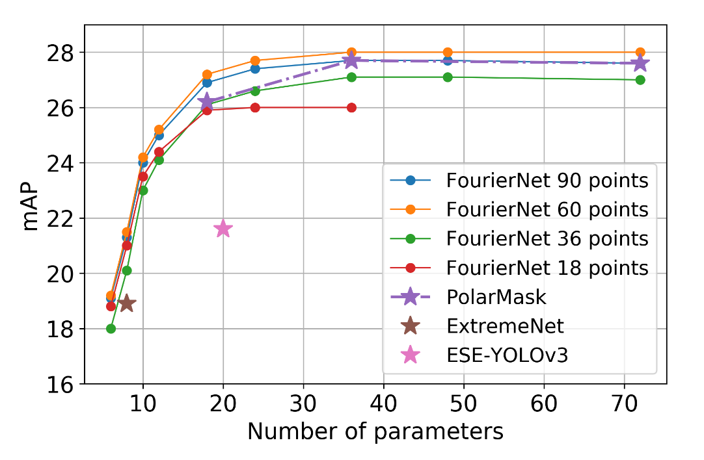

## Installation

### Requirements

- Ubuntu 18.04
- Python 3.7 
- PyTorch 1.4 & torchvision 0.5
- CUDA 10.1
- mmcv 0.2.14

### Install steps
For installation please check the mmdet installation guide, or try the commands below:


```shell
conda create -n fouriernet python=3.7
conda activate fouriernet
conda install pytorch torchvision -c pytorch

pip install cython ipython setuptools
pip install terminaltables matplotlib opencv-python pyyaml

pip install pycocotools six idna imagecorruptions polygon3 tqdm future tensorboard
git clone https://github.com/cogsys-tuebingen/FourierNet.git

cd mmdetection
pip install -r requirements.txt
pip install -v -e .
```


## A quick demo
To run a demo please download one of the trained models weights 
[here](https://drive.google.com/open?id=1g08c4P5ZhNWwVMHY2ON2tBdc3KFGPhVB). In ```demo/inference_demo.py```, 
set the variable ```model_weights```  to the path of the *.pth file you downloaded. 
Set the ```config_file``` to the path of the appropriate config file in the configs directory. 
Set the ```images_path``` with the directory containing the images you want to test and run ```demo/visualize.py```. 
In the config file you can change the variable ```visulize_coe``` to see the effect of changing the number of Fourier 
coefficents to represent the contour. Enjoy!  

Note: For fast code checking, check mmdet/ models/ anchor_heads/ fouriernet_head.py which contains most of our work.


## Testing and Training 
**Test:**

To make tests, first download the [COCO2017 dataset](http://cocodataset.org/#download) and then 
change the ```data_root``` variable in the config file to the path of the dataset, then run the following command:

```python tools/test.py {path to config file} {path to weights} --out {path to save evaluation} --eval segm```

example

```python tools/test.py configs/fourier_768_1x_r50_36_60.py tools/work_dirs/36_60/fourier_768_1x_r50_36_60.pth --out tools/work_dirs/36_60/results.pkl --eval segm```

**Train:**

Set the ```work_dir``` variable in the config file to the directory where you want to save your training results, 
and then depending on the number of GPUs available run one of the following command: 
##### 1. single gpu train
```python tools/test.py {path to config file} --gpus 1```

##### 2. 4gpu train
```sh ./tools/dist_train.sh  {path to config file} 4 --launcher pytorch --work_dir {path to working dir}```


## Contributing to the project
Any pull requests or issues are welcome.

## Credits
The authors want to thank [3Blue1Brown](https://www.youtube.com/channel/UCYO_jab_esuFRV4b17AJtAw) for his amazing video on [Fourier Series](https://www.youtube.com/watch?v=r6sGWTCMz2k&list=PLZHQObOWTQDNPOjrT6KVlfJuKtYTftqH6&index=4), 
which inspired them to do this work. In addition, the implementation of this code is based is based on [PolarMask](https://github.com/xieenze/PolarMask) implementation, 
which uses the [mmdetection](https://github.com/open-mmlab/mmdetection) framework.

## Citations
Please consider citing our paper in your publications if the project helps your research. BibTeX reference is as follows.

```
@article{benbarka2020fouriernet,
  title={FourierNet: Compact mask representation for instance segmentation using differentiable shape decoders},
  author={Nuri Benbarka and Hamd ul Moqeet Riaz and Andreas Zell},
  journal={arXiv preprint arXiv:2002.02709},
  year={2020}
}
```

## License

For academic use, this project is licensed under the 2-clause BSD License - see the LICENSE file for details. For commercial use, please contact the authors. 